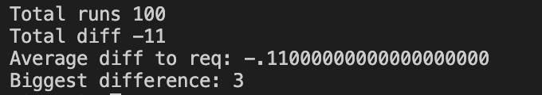

## Project passed with 110/100 points


## General info
lem_in is a project focused on data structures and graph traversal algoritms.

The goal of the project is to move n amount of ants from room start to end with the
least amount of moves.

Criteria is that the ants don't collide (only 1 ant in a room) and you may move ants once
per turn.

## Setup
```
$ make re
$ ./lem-in < <input_file>
```

## Algorithm
I used Edmonds-Karp's max flow algorithm with BFS to determine the optimal non-colliding set of paths.
I loop the EK algo as long as I have ants or as long as it can find flow and stores the paths found in each round.
BFS also ensures that the shortest path found is always the first.

After that, I do some math to determine the best set to use by calculating costs for each set I have.
```
cost for set = (steps + ants) / paths
```
Where<br>
steps = Total number of steps in set (all paths included)<br>
ants = The number of ants<br>
paths = The number of paths in set<br>

## Accuracy
Algorithm accuracy presented by:<br>
– Number of runs<br>
– Total diff (Optimal amount of moves VS amount of moves I got in total)<br>
– Average diff (Avg of how many lines +- I get / map)<br>


